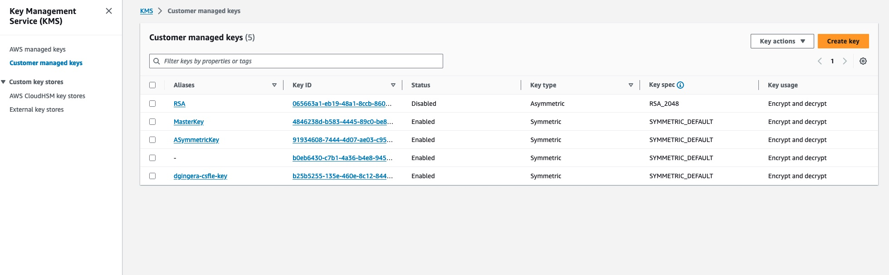
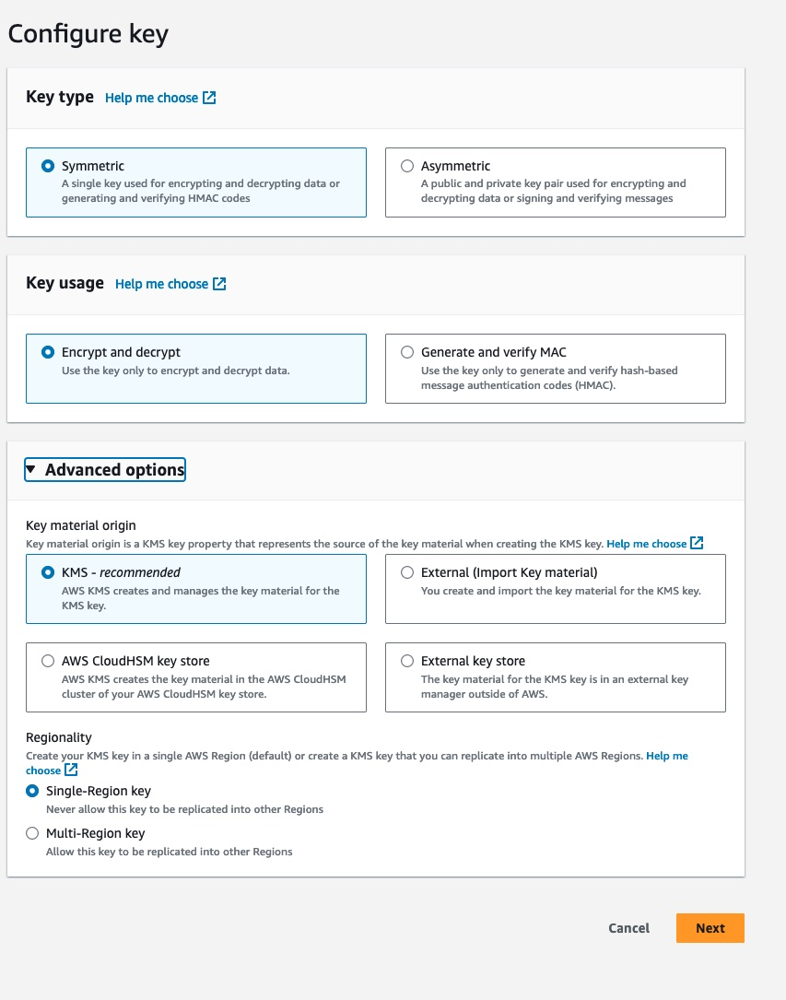
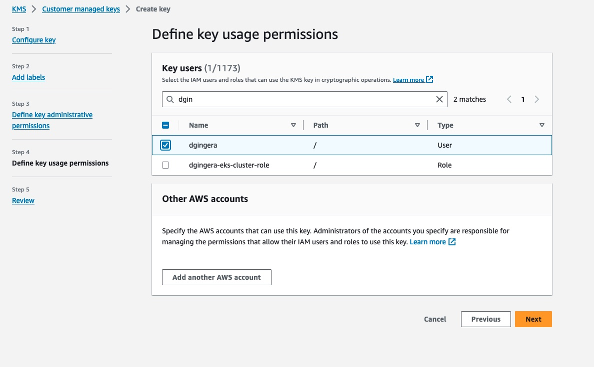
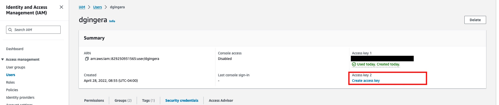
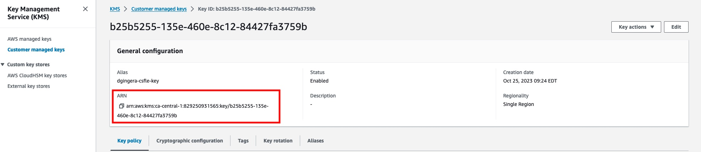
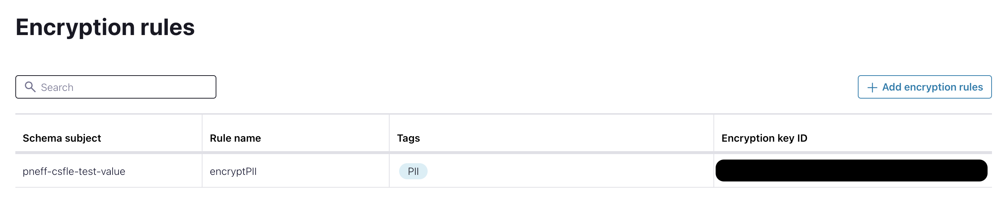
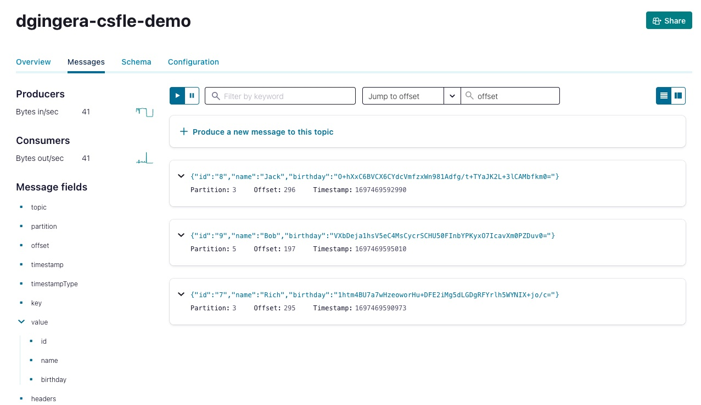

# Client-Side Field Level Encryption (CSFLE) with AWS KMS

This repository provides a step-by-step demo of the Confluent Cloud feature [Client-Side Field Level Encryption](http://staging-docs-independent.confluent.io/docs-cloud/PR/2843/current/clusters/csfle/overview.html).
As of today, this feature is in Early Access Program.

## Prerequisites

* Confluent Cloud cluster with Advanced Stream Governance package
* For clients, Confluent Platform 7.4.2 or 7.5.1 are required.

## Goal

We will produce personal data to Confluent Cloud in the following form 
```
{
    "id": "0",
    "name": "Anna",
    "birthday": "1993-08-01",
    "timestamp": "2023-10-07T19:54:21.884Z"
}
```
However, we set up the corresponding configurations to encrypt the `birthday` field.
We then start a consumer with the corresponding configurations to decrypt the field again.

In order to have a realistic scenario, we do not produce and consume via the CLI but develop a
producer and consumer application with Kotlin.

## Create Tag

We first need to create a tag on which we apply the encryption later, such as `PII`.
As of today, we need to create the tag in the Stream Catalog first, see the [documentation](https://docs.confluent.io/platform/current/schema-registry/fundamentals/data-contracts.html#tags) of Data Contracts.

## AWS KMS

In the KMS section of the AWS Management Console, create a new Symmetric Key with Encrypt/Decrypt configuration





As you click through this process you will be asked to define `Admins` and `Users` for your key. Ensure you grant access to the `User` that you want use in your Producer/Consumer app.



## AWS IAM

After your Key has been created, navigate to AWS IAM and create an Access Key for the User that you granted permissions to in the previous step.



:warning: **Important:** Ensure you copy your Access Key ID and Secret (or download the csv file) :warning:

## Register Schema

We register the schema with setting `PII` to the birthday field and define the encryption rule

```shell
curl --request POST --url 'https://psrc-d0vxy.ca-central-1.aws.confluent.cloud/subjects/dgingera-csfle-demo-value/versions'   \
  --header 'Authorization: Basic <base64 encoded SR Key:Secret>' \ 
  --header 'content-type: application/octet-stream' \
  --data '{
            "schemaType": "AVRO",
            "schema": "{  \"name\": \"PersonalData\", \"type\": \"record\", \"namespace\": \"com.csfleExample\", \"fields\": [{\"name\": \"id\", \"type\": \"string\"}, {\"name\": \"name\", \"type\": \"string\"},{\"name\": \"birthday\", \"type\": \"string\", \"confluent:tags\": [ \"PII\"]},{\"name\": \"timestamp\",\"type\": [\"string\", \"null\"]}]}",
            "metadata": {
            "properties": {
            "owner": "Dan Gingera",
            "email": "dgingera@confluent.io"
            }
          }
    }' 
```
## Register Rule

Go to AWS KMS and copy the ARN of the key you previously created. We need this ARN to register our encryption rule below.



Then, run the following curl to register the rule in Schema Registry. Alternatively, you can do this through the CC UI `Encryption Rules` section.

```shell
curl --request POST --url 'https://psrc-d0vxy.ca-central-1.aws.confluent.cloud/subjects/dgingera-csfle-demo-value/versions' --header 'Authorization: Basic <base64 encoded SR Key:Secret>' --header 'Content-Type: application/vnd.schemaregistry.v1+json' \
  --data '{
        "ruleSet": {
        "domainRules": [
      {
        "name": "encryptPII",
        "kind": "TRANSFORM",
        "type": "ENCRYPT",
        "mode": "WRITEREAD",
        "tags": ["PII"],
        "params": {
           "encrypt.kek.name": "<AWS KMS Key Name>",
           "encrypt.kms.key.id": "<AWS KMS Key ARN>",
           "encrypt.kms.type": "aws-kms"
          },
        "onFailure": "ERROR,NONE"
        }
        ]
      } 
    }'
```

We can check that everything is registered correctly by either executing
```shell
curl --request GET --url 'https://psrc-d0vxy.ca-central-1.aws.confluent.cloud/subjects/dgingera-csfle-demo-value/versions/latest' --header 'Authorization: Basic <base64 encoded SR Key:Secret>' | jq
```

or in the CC UI



## Producer configuration

### Gradle
We need to add
```shell
implementation("io.confluent:kafka-avro-serializer:7.5.1")
implementation("io.confluent:kafka-schema-registry-client-encryption-aws:7.5.1")
```

### Producer
We need to adjust the configuration by updating the following in the Producer/Consumer props files
```kotlin
// Encryption + AWS Credentials (this is the access key we created in the IAM section of this tutorial)
settings.setProperty("rule.executors._default_.param.access.key.id", "<AWS User Access Key ID>")
settings.setProperty("rule.executors._default_.param.secret.access.key", "<AWS User Access Key Secret>")

// Required since we manually create schemas
settings.setProperty("use.latest.version", "true")
settings.setProperty("auto.register.schemas","false")
```

We continuously produce data with the encryption (the topic `dgingera-csfle-demo` needs to be created before) by executing
```
./gradlew run
```

We can see in the logs that everything is working fine
```shell
11:17:33.077 [Thread-0] INFO  KafkaProducer - Kafka Producer started
11:17:34.495 [kafka-producer-network-thread | producer-1] INFO  KafkaProducer - event produced to dgingera-csfle-demo
11:17:36.665 [kafka-producer-network-thread | producer-1] INFO  KafkaProducer - event produced to dgingera-csfle-demo
```

or check the encrypted field messages in the CC UI



## Consumer

Update the Consumer properties file with the same Confluent Cloud cluster, Schema Registry, and GCP credentials you used for the producer and re-run.
```
./gradlew run
```

It may take a few seconds but then we can see all events with decrypted `birthday`
field:

```shell
[main] INFO  KafkaConsumer - We consumed the event {"id": "0", "name": "Anna", "birthday": "1993-08-01", "timestamp": "2023-10-07T20:48:02.624Z"}
[main] INFO  KafkaConsumer - We consumed the event {"id": "1", "name": "Joe", "birthday": "1996-09-11", "timestamp": "2023-10-07T20:48:18.005Z"}
```
