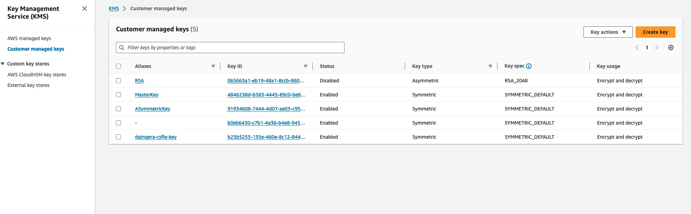
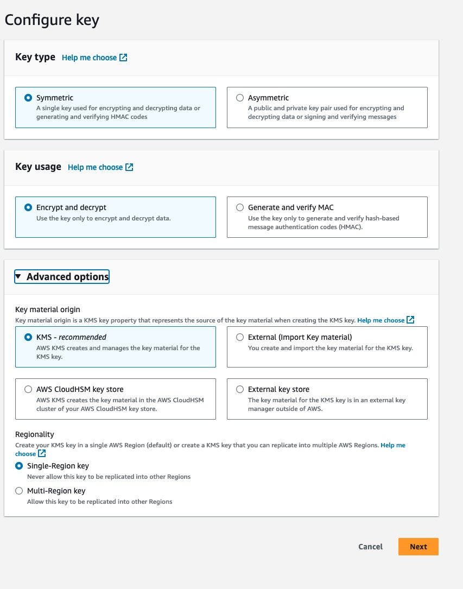
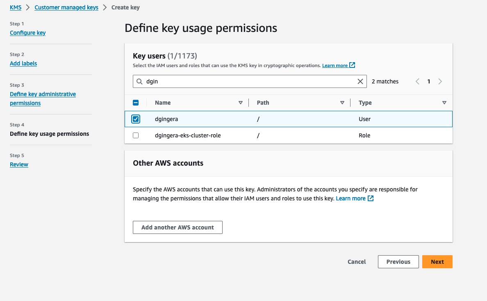
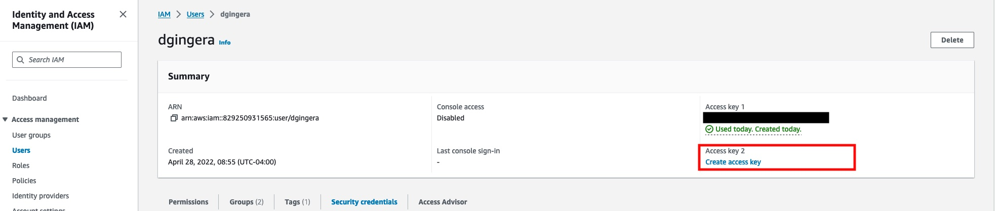

# 🔐 Client-Side Field Level Encryption (CSFLE) with AWS KMS

This repository provides a step-by-step demo of the Confluent Cloud
feature [Client-Side Field Level Encryption](https://docs.confluent.io/cloud/current/clusters/csfle/overview.html).

## 📋 Prerequisites

* Confluent Cloud cluster with Advanced Stream Governance package
* Python client versions -
  see [requirements](https://docs.confluent.io/cloud/current/security/encrypt/csfle/client-side.html#confluent-python-client-for-ak)

## 🎯 Goal

We will produce personal data to Confluent Cloud in the following format:

```json
{
  "id": "0",
  "name": "Anna",
  "birthday": "1993-08-01",
  "timestamp": "2023-10-07T19:54:21.884Z"
}
```

The `birthday` field will be encrypted using CSFLE. We'll then consume the data with proper credentials to decrypt it,
and simulate unauthorized access to demonstrate the security benefits.

To create a realistic scenario, we'll develop producer and consumer applications in Python rather than using the CLI.

## 🛠️ Setup

### 1. Python Environment

Create a virtual environment and install dependencies:

```shell
python -m venv .venv
source .venv/bin/activate
pip install -r requirements.txt
```

### 2. AWS KMS Configuration

#### Create Symmetric Key

In the AWS Management Console, navigate to KMS and create a new **Symmetric Key** with **Encrypt/Decrypt**
configuration:





During the creation process, define **Admins** and **Users** for your key. Ensure you grant access to the User that will
run your Producer/Consumer applications.



#### Create Access Key

After your KMS key is created, navigate to **AWS IAM** and create an **Access Key** for the User you granted permissions
to:



> ⚠️ **Important:** Copy your Access Key ID and Secret Access Key now (or download the CSV file). You won't be able to
> retrieve the secret later!

### 3. Environment Variables

Copy the example environment file and configure it with your credentials:

```shell
cp .env.example .env
```

Edit `.env` with your configuration values:

| Configuration                      | Environment Variable                   |
|------------------------------------|----------------------------------------|
| **Kafka Broker URL**               | `KAFKA_BOOTSTRAP_SERVERS`              |
| **Kafka API Key**                  | `KAFKA_SASL_USERNAME`                  |
| **Kafka API Secret**               | `KAFKA_SASL_PASSWORD`                  |
| **Schema Registry URL**            | `SCHEMA_REGISTRY_URL`                  |
| **Schema Registry API Key:Secret** | `SCHEMA_REGISTRY_BASIC_AUTH_USER_INFO` |
| **AWS KMS Key ARN**                | `AWS_KMS_KEY_ID`                       |
| **AWS KMS Key Name**               | `AWS_KMS_KEY_NAME`                     |
| **AWS Access Key ID**              | `AWS_ACCESS_KEY_ID`                    |
| **AWS Secret Access Key**          | `AWS_SECRET_ACCESS_KEY`                |

> ⚠️ **Security:** Never commit the `.env` file to version control as it contains sensitive credentials!

## 🏷️ Schema Configuration

### Create the PII Tag

First, create a tag in Confluent Cloud that we'll use to mark fields for encryption (e.g., `PII`).

Navigate to:
`Home > Environments > [Your-Environment] > Stream Governance > Catalog management > Tags > Create Tags > PII`

See
the [Data Contracts documentation](https://docs.confluent.io/platform/current/schema-registry/fundamentals/data-contracts.html#tags)
for more details.

### Load Environment Variables

Before running the schema registration commands, load your configuration:

```shell
# Load environment variables from .env file
set -a
source .env
set +a
```

> 💡 **Tip:** The `set -a` and `set +a` commands enable/disable automatic export of variables. You only need to source
> the environment once per shell session. **Note:** Exported variables only affect the current terminal session and don't
> persist across different terminals.

### Register the Schema

Register the Avro schema with the `PII` tag applied to the `birthday` field:

```shell
curl --location "$SCHEMA_REGISTRY_URL/subjects/$KAFKA_TOPIC-value/versions" \
--header 'Accept: application/vnd.schemaregistry.v1+json' \
--header 'Content-Type: application/json' \
--header "Authorization: Basic $(echo -n $SCHEMA_REGISTRY_BASIC_AUTH_USER_INFO | base64)" \
--data '{
    "schemaType": "AVRO",
    "schema": "{  \"name\": \"PersonalData\", \"type\": \"record\", \"namespace\": \"com.csfleExample\", \"fields\": [{\"name\": \"id\", \"type\": \"string\"}, {\"name\": \"name\", \"type\": \"string\"},{\"name\": \"birthday\", \"type\": \"string\", \"confluent:tags\": [ \"PII\"]},{\"name\": \"timestamp\",\"type\": [\"string\", \"null\"]}]}"
}'
```

### Register the Encryption Rule

Define the encryption rule for all fields tagged with `PII`:

```shell
curl --location "$SCHEMA_REGISTRY_URL/subjects/$KAFKA_TOPIC-value/versions" \
--header 'Accept: application/vnd.schemaregistry.v1+json' \
--header 'Content-Type: application/json' \
--header "Authorization: Basic $(echo -n $SCHEMA_REGISTRY_BASIC_AUTH_USER_INFO | base64)" \
--data '{
    "ruleSet": {
        "domainRules": [
            {
                "name": "encryptPII",
                "kind": "TRANSFORM",
                "type": "ENCRYPT",
                "mode": "WRITEREAD",
                "tags": [
                    "PII"
                ],
                "params": {
                    "encrypt.kek.name": "'"$AWS_KMS_KEY_NAME"'",
                    "encrypt.kms.key.id": "'"$AWS_KMS_KEY_ID"'",
                    "encrypt.kms.type": "'"$AWS_KMS_TYPE"'"
                },
                "onFailure": "ERROR,NONE"
            }
        ]
    }
}'
```

> 💡 **Tip:** The pattern `"'"$VARIABLE"'"` is necessary to interpolate shell variables inside JSON strings. It works by
> ending the single-quoted JSON string, adding a double-quoted variable, then starting the single-quoted string again.

### Verify Configuration

Check that everything is registered correctly:

```shell
curl --request GET \
  --url "$SCHEMA_REGISTRY_URL/subjects/$KAFKA_TOPIC-value/versions/latest" \
  --header "Authorization: Basic $(echo -n $SCHEMA_REGISTRY_BASIC_AUTH_USER_INFO | base64)" | jq
```

You can also verify in the Confluent Cloud UI:


## 🚀 Running the Demo

### Produce Encrypted Data

Run the producer to send data with the encrypted `birthday` field:

```shell
python avro_producer.py
```

✅ Expected output:

```log
PersonalData record b'2' successfully produced to <YOUR TOPIC NAME> [1] at offset 0
```

### Consume with Valid Credentials

Run the consumer with valid AWS credentials to see decrypted data:

```shell
python avro_consumer.py
```

✅ Expected output (decrypted birthday):

```log
--- Personal Data ---
  ID:        19
  Name:      Anna
  Birthday:  2006-12-12
  Timestamp: 2025-12-12T15:11:42.477591+00:00
---------------------
```

### 🔒 Testing Unauthorized Access

Simulate a scenario where a client **without access to the KEK** tries to consume the encrypted data by temporarily
setting invalid AWS credentials:

```shell
# Temporarily override AWS credentials with invalid values
export AWS_SECRET_ACCESS_KEY="invalid_secret_key"
# Change the consumer group ID to re-consume all the messages from the topic
export KAFKA_GROUP_ID="testing-invalid-key"

# Run the consumer - it will fail to decrypt the birthday field
python avro_consumer.py
```

🔴 Expected output (encrypted birthday remains encrypted):

```log
--- Personal Data ---
  ID:        2
  Name:      Anna
  Birthday:  yabvlkT//S+QDAXP7idIl3wU3pHR8/2oZZA8ORovepAun1eLORo=
  Timestamp: 2025-12-12T15:11:42.476313+00:00
---------------------
```

✨ **This demonstrates that consumers without access to the KEK cannot decrypt fields protected by CSFLE**

### Restore Valid Credentials

To restore your correct AWS credentials for subsequent operations:

```shell
# Re-load environment variables from .env to restore correct credentials
set -a
source .env
set +a
```

> 💡 **Remember:** Exported variables only affect the current terminal session. If you open a new terminal, you'll need
> to source `.env` again.
