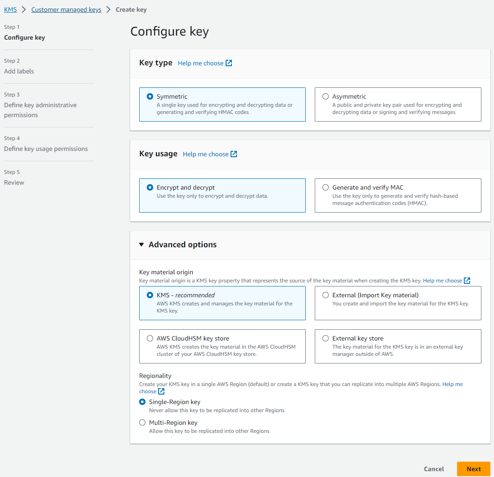
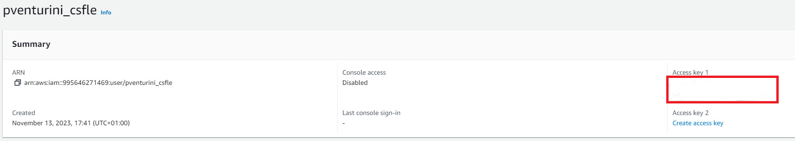
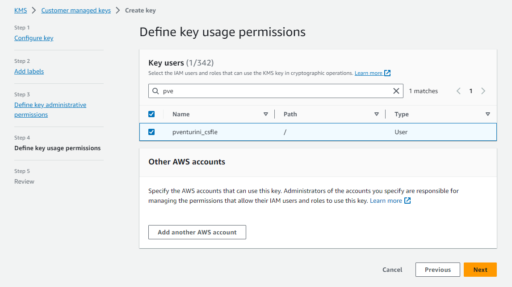
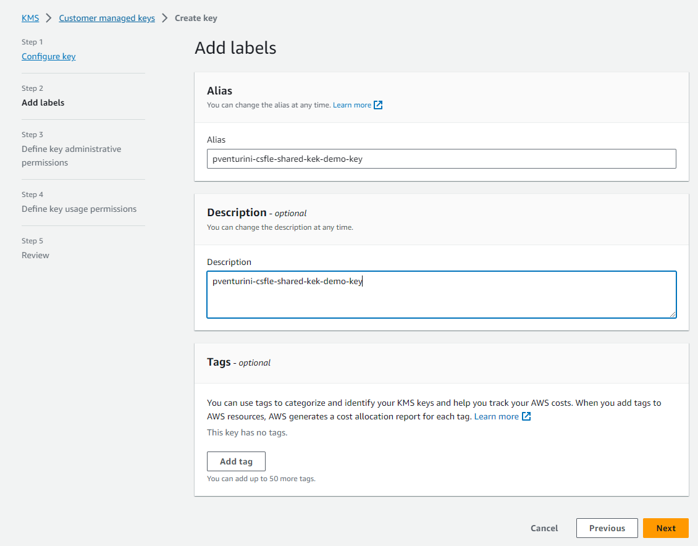
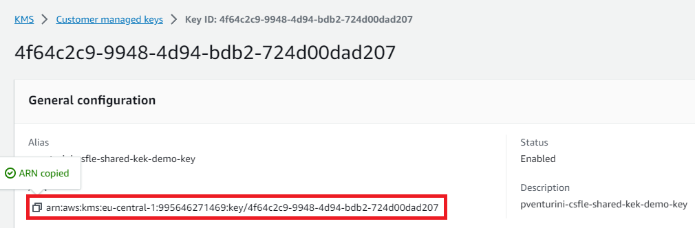
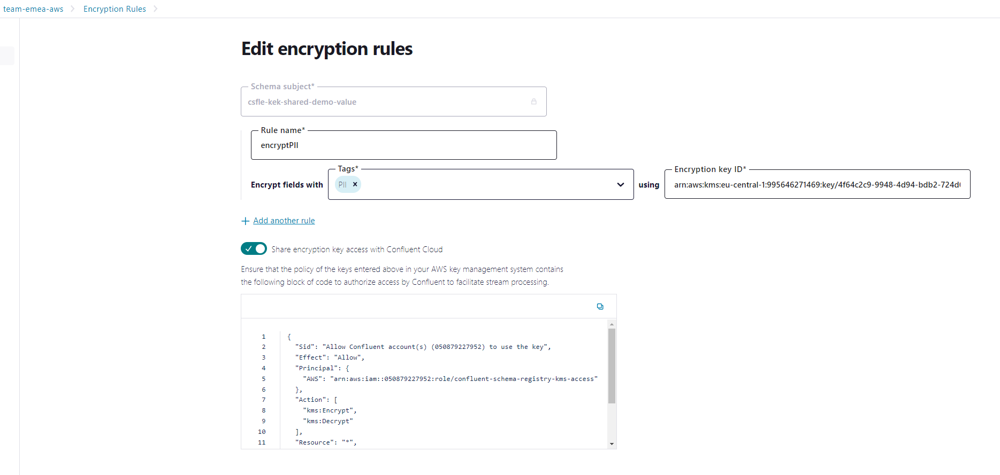
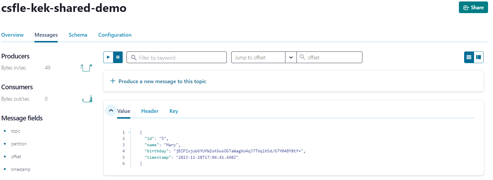

# Client-Side Field Level Encryption (CSFLE) with AWS KMS, KMS access shared with Confluent

This repository provides a step-by-step demo of the Confluent Cloud feature [Client-Side Field Level Encryption](http://staging-docs-independent.confluent.io/docs-cloud/PR/2843/current/clusters/csfle/overview.html).
As of today, this feature is in Early Access Program.
This example implements the CSFLE shared KEK flow, meaning that the DEK Registry has access to the KMS. In this scenario:
* clients do not need KMS credentials to retrieve the master key and decrypt the DEKs, in fact the DEK Registry will make the decrypted DEK available to authorized clients
* Confluent components such as ksqlDB and Flink will be able to decrypt the fields and enable further use cases. Please note that ksqlDB, Flink support for CSFLE is not available at the moment 

## Prerequisites

* Confluent Cloud cluster with Advanced Stream Governance package
* For clients, Confluent Platform 7.4.2 or 7.5.1 are required.

## Goal

We will produce personal data to Confluent Cloud in the following form 
```
{
    "id": "0",
    "name": "Anna",
    "birthday": "1993-08-01",
    "timestamp": "2023-10-07T19:54:21.884Z"
}
```
However, we set up the corresponding configurations to encrypt the `birthday` field.
We then start a consumer with the corresponding configurations to decrypt the field again.

## Create Tag

We first need to create a tag on which we apply the encryption later, such as `PII`.
As of today, we need to create the tag in the Stream Catalog first, see the [documentation](https://docs.confluent.io/platform/current/schema-registry/fundamentals/data-contracts.html#tags) of Data Contracts.

## AWS KMS

In the KMS section of the AWS Management Console, create a new Symmetric Key with Encrypt/Decrypt configuration





### Optional - KMS User (ServiceAccount) registration
As you click through this process you will be asked to define `Admins` and `Users` for your key. 
There is no need to grant access to a user `User` (ServiceAccount) in order to try the shared KMS flow as clients do not need to interact with the KMS.

However, if you want to test as well [KMS access toggling feature](#toggling-master-key-sharing), please grant access to a User and then navigate to AWS IAM by creating an Access Key for the same User.






## Retrieving AWS KMS key ARN

Finally go to AWS KMS section again and copy the ARN of the key you previously created. We need this ARN to register our encryption rule below




## Preliminary parameters configuration

All the CLI command invocations and Kotlin applications used in this tutorial can be configured with OS env variables in order to suit your specific environment.
Before moving on, please configure a .env file (assuming it is created in this repo base path) and configure it according to your environment

```shell
cat <<EOF >> .env
#!/bin/sh
##
export TARGET_TOPIC=csfle-kek-shared-demo
export TARGET_CONSUMER_GROUP=csfle-cg
export CC_API_KEY=<CONFLUENT_API_KEY>
export CC_API_SECRET=<CONFLUENT_API_SECRET>
export CC_BOOTSRAP_SERVER=<CONFLUENT_BOOTSTRAP_URL>
export SR_URL=https://<SR_BASE_URL>
export SR_CRED=<SR_API_KEY:SR_API_SECRET>
export SR_BASE64_CRED=<CREATE THIS BY RUNNING echo -en "<SR_API_KEY:SR_API_SECRET>" | base64 -w0>
export AWS_KEK_NAME=pventurini-csfle-shared-kek-demo-key
export AWK_KMS_KEY_ID=<KMS_KEY_ARN>
EOF
```

Source the env variables before running commands in each terminal used

```shell
source .env
```

## Register Schema

We register the schema with setting `PII` to the birthday field and define the encryption rule

```shell
curl --request POST \
  --url "${SR_URL}/subjects/csfle-kek-shared-demo-value/versions" \
  --header "Authorization: Basic ${SR_BASE64_CRED}" \
  --header "Content-Type: application/vnd.schemaregistry.v1+json" \
  --data '{
            "schemaType": "AVRO",
            "schema": "{  \"name\": \"PersonalData\", \"type\": \"record\", \"namespace\": \"com.csfleExample\", \"fields\": [{\"name\": \"id\", \"type\": \"string\"}, {\"name\": \"name\", \"type\": \"string\"},{\"name\": \"birthday\", \"type\": \"string\", \"confluent:tags\": [ \"PII\"]},{\"name\": \"timestamp\",\"type\": [\"string\", \"null\"]}]}",
            "metadata": {
            "properties": {
            "owner": "Paolo Venturini",
            "email": "pventurini@confluent.io"
            }
          }
    }'
```
## Registering KEK

We register a KEK so that it can be referenced by encryption rules

```shell

curl --request POST \
  --url "${SR_URL}/dek-registry/v1/keks" \
  --header "Authorization: Basic ${SR_BASE64_CRED}" \
  --header 'Content-Type: application/vnd.schemaregistry.v1+json' \
  --data "{
    \"name\": \"${AWS_KEK_NAME}\",
	  \"kmsType\": \"aws-kms\",
	  \"kmsKeyId\": \"${AWK_KMS_KEY_ID}\",
	  \"shared\": true	
}"
```


## Register Encryption Rules


Then, run the following curl to register the rule in Schema Registry. Alternatively, you can do this through the CC UI `Encryption Rules` section.

```shell
curl --request POST \
  --url "${SR_URL}/subjects/csfle-kek-shared-demo-value/versions" \
  --header "Authorization: Basic ${SR_BASE64_CRED}" \
  --header 'Content-Type: application/vnd.schemaregistry.v1+json' \
  --data "{
        \"ruleSet\": {
        \"domainRules\": [
      {
        \"name\": \"encryptPII\",
        \"kind\": \"TRANSFORM\",
        \"type\": \"ENCRYPT\",
        \"mode\": \"WRITEREAD\",
        \"tags\": [\"PII\"],
        \"params\": {
           \"encrypt.kek.name\": \"${AWS_KEK_NAME}\"
          },
        \"onFailure\": \"ERROR,NONE\"
        }
        ]
      } 
    }"
```

We can check that everything is registered correctly by either executing
```shell
curl  --url "${SR_URL}/subjects/csfle-kek-shared-demo-value/versions/latest"   --header "Authorization: Basic ${SR_BASE64_CRED}"  | jq
```

## Allowing the DEK Registry to access the KMS

Retrieve the permission statements

```shell
curl  --url "${SR_URL}/dek-registry/v1/policy"  --header "Authorization: Basic ${SR_BASE64_CRED}"  | jq
{
  "Sid": "Allow Confluent account(s) (<000000000001>) to use the key",
  "Effect": "Allow",
  "Principal": {
    "AWS": "arn:aws:iam::000000000001:role/confluent-schema-registry-kms-access"
  },
  "Action": [
    "kms:Encrypt",
    "kms:Decrypt"
  ],
  "Resource": "*",
  "Condition": {
    "StringEquals": {
      "aws:PrincipalTag/TenantID": "lsrc-q8okkm"
    }
  }
}
```

Go back in the KMS key policy configuration on AWS.  Press on "Switch to policy view" button and add permission statements in your AWS KMS policy




## Run the Producer

We continuously produce data with the encryption (the topic `csfle-kek-shared-demo` needs to be created before) by executing
```
./gradlew run
```

We can see in the logs that everything is working fine

```shell
11:17:33.077 [Thread-0] INFO  KafkaProducer - Kafka Producer started
11:17:34.495 [kafka-producer-network-thread | producer-1] INFO  KafkaProducer - event produced to csfle-kek-shared-demo
11:17:36.665 [kafka-producer-network-thread | producer-1] INFO  KafkaProducer - event produced to csfle-kek-shared-demo
```

or check the encrypted field messages in the CC UI



## Run the Consumer (Gradle)

```
./gradlew run
```

It may take a few seconds but then we can see all events with decrypted `birthday`
field:

```shell
[main] INFO  KafkaConsumer - We consumed the event {"id": "2", "name": "Peter", "birthday": "1993-02-22", "timestamp": "2023-11-28T17:01:58.210Z"}
[main] INFO  KafkaConsumer - We consumed the event {"id": "3", "name": "Homer", "birthday": "1994-04-16", "timestamp": "2023-11-28T17:02:00.213Z"}

```

## Run the kafka-avro-console-consumer

```shell
kafka-avro-console-consumer --topic ${TARGET_TOPIC}  --bootstrap-server   ${CC_BOOTSRAP_SERVER}   --property schema.registry.url=${SR_URL} --property basic.auth.user.info="${SR_CRED}" --property basic.auth.credentials.source=USER_INFO --from-beginning --consumer-property security.protocol=SASL_SSL --consumer-property sasl.mechanism=PLAIN --consumer-property sasl.jaas.config="org.apache.kafka.common.security.plain.PlainLoginModule required username=\"${CC_API_KEY}\" password=\"${CC_API_SECRET}\";"
```

## Toggling Master Key sharing

KMS Confluent access can be toggled (enabled/disabled).

When sharing is disabled and the DEK Registry has no longer access to the Master Key, clients will be provided with the encrypted DEK.
That means they won't be able to decrypt encrypted fields unless they have configured valid credentials to reach directly the KMS, fetch the primary key and decrypt the DEK.
Data can be still consumed as we configured NONE as failure Action during the record consumption.

Disabling master key access:

```shell
curl --request PUT \
--url "${SR_URL}/dek-registry/v1/keks/${AWS_KEK_NAME}" \
--header "Authorization: Basic ${SR_BASE64_CRED}" \
--header 'Content-Type: application/vnd.schemaregistry.v1+json' \
--data '{ "shared": false}'

```
Trying to consume with KEK sharing disabled

```shell
kafka-avro-console-consumer --topic ${TARGET_TOPIC}  --bootstrap-server   ${CC_BOOTSRAP_SERVER}   --property schema.registry.url=${SR_URL} --property basic.auth.user.info="${SR_CRED}" --property basic.auth.credentials.source=USER_INFO --from-beginning --consumer-property security.protocol=SASL_SSL --consumer-property sasl.mechanism=PLAIN --consumer-property sasl.jaas.config="org.apache.kafka.common.security.plain.PlainLoginModule required username=\"${CC_API_KEY}\" password=\"${CC_API_SECRET}\";"
```

We can see in the logs that birthday is encrypted

```shell
.. Caused by: com.amazonaws.SdkClientException: Unable to load AWS credentials from any provider in the chain: [EnvironmentVariableCredentialsProvider: Unable to load AWS credentials from environment variables (AWS_ACCESS_KEY_ID (or..
{"id":"6","name":"Sven","birthday":"/u5Nhlh6LEBE8xzhEOWuNGPmsbKBRrMe4lg4UgGitkZe0k13vsg=","timestamp":{"string":"2023-11-28T16:49:10.322Z"}}
```

If you want to decrypt keys when the KMS sharing is disabled, please make sure KMS credentials available to the client.


```shell
export AWS_ACCESS_KEY_ID=<AWS_ACCESS_KEY_ID>
export AWS_SECRET_ACCESS_KEY=<AWS_SECRET_ACCESS_KEY>
kafka-avro-console-consumer --topic ${TARGET_TOPIC}  --bootstrap-server   ${CC_BOOTSRAP_SERVER}   --property schema.registry.url=${SR_URL} --property basic.auth.user.info="${SR_CRED}" --property basic.auth.credentials.source=USER_INFO --from-beginning --consumer-property security.protocol=SASL_SSL --consumer-property sasl.mechanism=PLAIN --consumer-property sasl.jaas.config="org.apache.kafka.common.security.plain.PlainLoginModule required username=\"${CC_API_KEY}\" password=\"${CC_API_SECRET}\";"
..
{"id":"4","name":"Laura","birthday":"1995-04-08","timestamp":{"string":"2023-11-28T17:23:48.283Z"}}
{"id":"4","name":"Laura","birthday":"1995-04-08","timestamp":{"string":"2023-11-28T17:24:19.694Z"}}
{"id":"4","name":"Laura","birthday":"1995-04-08","timestamp":{"string":"2023-11-28T17:24:51.179Z"}}
```

Sharing again the Master key with Confluent 

```shell
curl --request PUT \
--url "${SR_URL}/dek-registry/v1/keks/${AWS_KEK_NAME}" \
--header "Authorization: Basic ${SR_BASE64_CRED}" \
--header 'Content-Type: application/vnd.schemaregistry.v1+json' \
--data '{ "shared": true}'

```

Unset KMS credentials which are no longer needed as the client will receive the decrypted DEK directly from the Registry
```shell
unset AWS_ACCESS_KEY_ID
unset AWS_SECRET_ACCESS_KEY
kafka-avro-console-consumer --topic ${TARGET_TOPIC}  --bootstrap-server   ${CC_BOOTSRAP_SERVER}   --property schema.registry.url=${SR_URL} --property basic.auth.user.info="${SR_CRED}" --property basic.auth.credentials.source=USER_INFO --from-beginning --consumer-property security.protocol=SASL_SSL --consumer-property sasl.mechanism=PLAIN --consumer-property sasl.jaas.config="org.apache.kafka.common.security.plain.PlainLoginModule required username=\"${CC_API_KEY}\" password=\"${CC_API_SECRET}\";"
..
{"id":"0","name":"Anna","birthday":"1993-08-01","timestamp":{"string":"2023-11-28T17:36:14.593Z"}}
{"id":"2","name":"Peter","birthday":"1993-02-22","timestamp":{"string":"2023-11-28T17:36:19.981Z"}}
..
```

