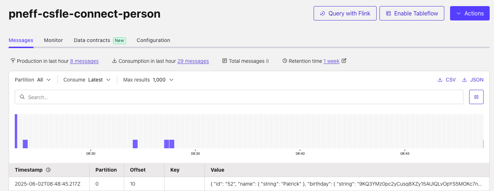

# Client-Side Field Level Encryption (CSFLE) with Azure Key Vault for Self-Managed Connectors against Confluent Cloud

This repository provides a step-by-step guideline of the Confluent Cloud feature [CSFLE for Self-Managed Connectors](https://docs.confluent.io/platform/current/connect/manage-csfle.html#manage-csfle-for-self-managed-connectors).

> [!NOTE]
> We will deploy the Connect Cluster and Connector using Confluent for Kubernetes (CFK) on an Azure Kubernetes Service (AKS).


## Prerequisites

* Confluent Cloud cluster with Advanced Stream Governance package

## Goal

We will produce personal data to Confluent Cloud in the following form
```
{
    "id": "1",
    "name": "Anna",
    "birthday": "1993-08-01"
}
```
However, we set up the corresponding configurations to encrypt the birthday field.

## Set up Azure Key Vault and Confluent Cloud

Please follow the steps as explained in [../azure](../azure/README.md) until "Producer Configuration".

> [!NOTE]
> Because we are using CFK on AKS, we also need to provide Key Vault permissions to the Service Principal of the AKS
> 
> The schema differs a bit compared to the example in azure.
> Please use the following adapted commands

### Register Schema

We register the schema with setting `PII` to the birthday field and defining the encryption rule

```shell
curl --request POST --url 'https://psrc-abc.westeurope.azure.confluent.cloud/subjects/pneff-csfle-connect-person-value/versions'   \
  --header 'Authorization: Basic <SR API Key>:<SR API Secret>' \ <-- base64 encoded credentials
  --header 'content-type: application/vnd.schemaregistry.v1+json' \
  --data '{
            "schemaType": "AVRO",
            "schema": "{\"connect.name\": \"person\", \"fields\": [{\"name\": \"id\", \"type\": \"long\"}, {\"default\": null, \"name\": \"name\", \"type\": [\"null\", \"string\"]}, {\"default\": null, \"name\": \"birthday\", \"type\": [\"null\", \"string\"], \"confluent:tags\": [ \"PII\"]}], \"name\": \"person\", \"type\": \"record\"}",
            "metadata": {
          }
    }' 
```
### Register Rule

```shell
curl --request POST --url 'https://psrc-abc.westeurope.azure.confluent.cloud/subjects/pneff-csfle-connect-person-value/versions'   \
  --header 'Authorization: Basic <SR API Key>:<SR API Secret>' \ <-- base64 encoded credentials
  --header 'Content-Type: application/vnd.schemaregistry.v1+json' \
  --data '{
        "ruleSet": {
        "domainRules": [
      {
        "name": "encrypt_birthdate_mysql",
        "kind": "TRANSFORM",
        "type": "ENCRYPT",
        "mode": "WRITEREAD",
        "tags": ["PII"],
        "params": {
           "encrypt.kek.name": "pneff-csfle-connect",
           "encrypt.kms.key.id": "<Azure Key Identifier>",
           "encrypt.kms.type": "azure-kms"
          },
        "onFailure": "ERROR,NONE"
        }
        ]
      } 
    }'
```

## Deploy AKS and CFK

* Please follow [Quickstart: Deploy an Azure Kubernetes Service (AKS) cluster using Azure portal](https://learn.microsoft.com/en-us/azure/aks/learn/quick-kubernetes-deploy-portal?tabs=azure-cli)
to set up AKS.
* Then deploy the CFK operator as explained in [Confluent for Kubernetes Quick Start](https://docs.confluent.io/operator/current/co-quickstart.html).
* Finally, crate the `confluent` namespace via

```shell
kubectl create ns confluent
```

## Set up MySQL service
We are following the [Kubernetes documentation](https://kubernetes.io/docs/tasks/run-application/run-single-instance-stateful-application/)


```shell
kubectl config set-context --current --namespace=confluent
kubectl apply -f https://k8s.io/examples/application/mysql/mysql-pv.yaml
kubectl apply -f https://k8s.io/examples/application/mysql/mysql-deployment.yaml
```

In a second terminal window, run a MySQL client to connect to the server:
```shell
kubectl run -it --rm --image=mysql:5.6 --restart=Never mysql-client -- mysql -h mysql -ppassword
```

Inside the shell you will create a database, a table, and entries:

```roomsql
CREATE DATABASE IF NOT EXISTS connect;
USE connect;

CREATE TABLE IF NOT EXISTS person (
  id serial NOT NULL PRIMARY KEY,
  name varchar(100),
  birthday varchar(200)
);

INSERT INTO person (name, birthday) VALUES ('Anna', '1993-08-01');
INSERT INTO person (name, birthday) VALUES ('Joe', '1996-09-11');
```

Verify that the data is in the table:
```roomsql
SELECT * from person;
```

## Set up the Connect Cluster

Create k8s Secrets for the Confluent Cloud Cluster API Key and Confluent Cloud Schema Registry API Key. 
You need to paste the key in the corresponding file first.

```
kubectl -n confluent create secret generic ccloud-credentials --from-file=plain.txt=./ccloud-credentials.txt  
kubectl -n confluent create secret generic ccloud-sr-credentials --from-file=basic.txt=./ccloud-sr-credentials.txt
```
Create a k8s Secret for the JDBC connector to pull the connection URL and password for the MySQL server

```
kubectl -n confluent create secret generic mysql-credential \
  --from-file=sqlcreds.txt=./sqlcreds.txt
```

Deploy the Connect Cluster

```shell
kubectl -n confluent apply -f ./connect.yaml
```

Verify that the plugin has been successfully installed via

```shell
kubectl port-forward connect-0 8083
```
```shell
curl -s -XGET http://localhost:8083/connector-plugins | jq '.[].class'
```

> [!NOTE]
> Be aware that when adding the JDBC connector, we need to use at least version 10.8.2 as stated in the documentation.
> Also as stated [here](https://docs.confluent.io/kafka-connectors/jdbc/10.8/jdbc-drivers.html#mysql-server), we need to add
> a JDBC driver for MySQL. Therefore, we download the driver and upload it together with the JDBC connector as a zip file. 

## Deploy the JDBC Source Connector

Before deploying the actual connector, we need to create the corresponding Kafka topic `pneff-csfle-connect-person`. 
This is a combination of the prefix (configured in the connector configuration) and the database table name.

Deploy the connector:
```shell
kubectl -n confluent apply -f ./jdbc-source-connector.yaml 
```

> [!NOTE]
> Be aware to add the required configurations for CSLFE to the connector configuration as stated in the documentation.

```yaml
# required to explicitly set the SR configurations in the connector (we validated it)
value.converter: "io.confluent.connect.avro.AvroConverter"
value.converter.schema.registry.url: "<SR URL>"
value.converter.basic.auth.user.info: "<KEY>:<SECRET>"
value.converter.basic.auth.credentials.source: "USER_INFO"
value.converter.auto.register.schemas: "false"
value.converter.use.latest.version: "true"
value.converter.latest.cache.ttl.sec: "1"

# required to explicitly set the SR configurations in the connector (we validated it)
key.converter: "io.confluent.connect.avro.AvroConverter"
key.converter.schema.registry.url: "<SR URL>"
key.converter.basic.auth.user.info: "<KEY>:<SECRET>"
key.converter.basic.auth.credentials.source: "USER_INFO"
key.converter.auto.register.schemas: "false"
key.converter.use.latest.version: "true"

# CSFLE, see https://docs.confluent.io/platform/current/connect/manage-csfle.html#enable-csfle-for-connectors
csfle.enabled: "true"
rule.executors._default_.param.tenant.id: "<tenant ID>"
rule.executors._default_.param.client.id: "<client ID>"
rule.executors._default_.param.client.secret: "<secret value>"
```

## Verify
Check if the connector is up and running via
```shell
kubectl port-forward connect-0 8083
```
```shell
curl -X GET http://localhost:8083/connectors/jdbc-source/status
```

In the MySQL client terminal, add another entry
```roomsql
INSERT INTO person (name, birthday) VALUES ('Patrick', '1993-08-26');
```

In CC, we see the encrypted field



