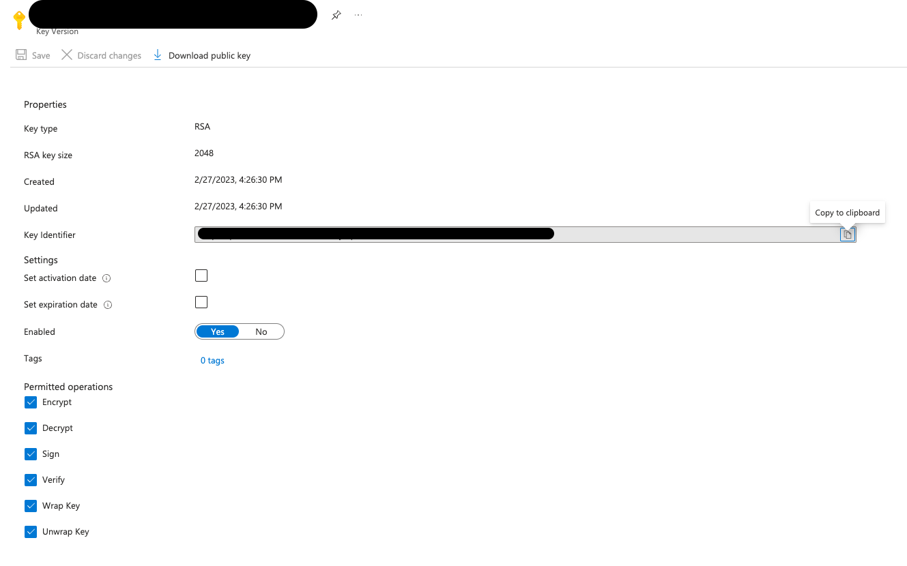
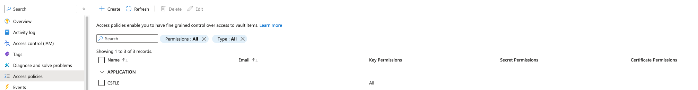

# 🔐 Client-Side Field Level Encryption (CSFLE) with Confluent Platform and Azure Key Vault

This directory provides a Python implementation of the Client-Side Field Level Encryption (CSFLE) demo using Confluent
Platform running locally with Docker Compose.

## 📋 Prerequisites

* Docker and Docker Compose
* Python 3.7 or later
* Azure account with Key Vault access

## 🎯 Goal

We will produce personal data to a local Kafka topic in the following format:

```json
{
  "id": "1",
  "name": "Anna",
  "birthday": "2024-02-10",
  "timestamp": "2025-02-10T19:54:21.884Z"
}
```

The `birthday` field will be encrypted using CSFLE with Azure Key Vault. We'll then consume the data with proper
credentials to
decrypt it, and simulate unauthorized access to demonstrate the security benefits.

## 🛠️ Setup

### 1. Python Environment

Create a virtual environment and install dependencies:

```shell
python -m venv venv
source venv/bin/activate
pip install -r requirements.txt
```

### 2. Azure Key Vault Configuration

#### 2.1 Create Azure App Registration

First, create an application in Azure:

1. Go to Microsoft Entra ID
2. From the left side menu, navigate to App registrations > New registration
3. Provide a name for your app and click Register

See the [Quickstart documentation](https://learn.microsoft.com/en-us/azure/active-directory/develop/quickstart-register-app) for detailed steps.

Next, create client credentials:

1. Navigate to your registered app
2. Create a client secret that will be used by the Python application to access the Key Vault
3. Copy the following values (you'll need them for the `.env` file):
   * **Secret value** (not the secret ID - copy this immediately after creating the client secret)
   * **Tenant ID** (from the app overview page)
   * **Client ID** (from the app overview page)

#### 2.2 Create Key Vault and Key

Create a Key Vault and generate a key:

1. Create a new Key Vault in Azure
2. Generate a new key within the Key Vault
3. Copy the **Key Identifier** as shown below:



#### 2.3 Assign Key Vault Access Policy

Grant your application permission to use the key:

1. Navigate to your Key Vault
2. Go to Access policies
3. Add an access policy for your registered application
4. Grant **All Key Permissions** (in production, follow the principle of least privilege)

See the [Access Policy documentation](https://learn.microsoft.com/en-us/azure/key-vault/general/assign-access-policy?tabs=azure-portal) for detailed steps.



### 3. Environment Variables

Copy the example environment file from the parent directory and configure it with your credentials:

```shell
cd .. && cp .env.example .env && cd python
```

Edit `.env` with your configuration values:

| Configuration                | Environment Variable      | Default/Example Value         |
|------------------------------|---------------------------|-------------------------------|
| **Kafka Topic**              | `KAFKA_TOPIC`             | `csfle-demo`                  |
| **Kafka Bootstrap Servers**  | `KAFKA_BOOTSTRAP_SERVERS` | `localhost:9091`              |
| **Schema Registry URL**      | `SCHEMA_REGISTRY_URL`     | `http://localhost:8081`       |
| **Azure KMS Key Identifier** | `AZURE_KMS_KEY_ID`        | Your Key Vault Key ID         |
| **Azure KMS Key Name**       | `AZURE_KMS_KEY_NAME`      | `csfle-demo-kek`              |
| **Azure Tenant ID**          | `AZURE_TENANT_ID`         | Your Azure Tenant ID          |
| **Azure Client ID**          | `AZURE_CLIENT_ID`         | Your Service Principal ID     |
| **Azure Client Secret**      | `AZURE_CLIENT_SECRET`     | Your Service Principal Secret |
| **Consumer Group ID**        | `KAFKA_GROUP_ID`          | `csfle-demo-consumer-group`   |
| **Auto Offset Reset**        | `KAFKA_AUTO_OFFSET_RESET` | `earliest`                    |

> ⚠️ **Security:** Never commit the `.env` file to version control as it contains sensitive credentials!
> 💡 **Note:** Confluent Platform runs locally using PLAINTEXT protocol (no SASL/SSL) for Kafka and no authentication for
> Schema Registry. However, Azure Key Vault is still used for field-level encryption.

### 4. Start Confluent Platform

From the parent directory, start Confluent Platform using Docker Compose:

```shell
cd ../..
docker compose up -d
```

Wait a few seconds for all services to start. You can check the logs:

```shell
docker compose logs -f
```

You can also access [Control Center](http://localhost:9021/) to monitor the cluster.

## 🏷️ Schema Configuration

### Load Environment Variables

Before running the schema registration commands, load your configuration:

```shell
# Make sure you're  in the python directory
cd azure/python

# Load environment variables from parent directory's .env file
set -a
source ../.env
set +a
```

> 💡 **Tip:** The `set -a` and `set +a` commands enable/disable automatic export of variables. You only need to source
> the environment once per shell session. **Note:** Exported variables only affect the current terminal session and
> don't
> persist across different terminals.

### Register the Schema

Register the Avro schema with the `PII` tag applied to the `birthday` field:

```shell
curl --location "$SCHEMA_REGISTRY_URL/subjects/$KAFKA_TOPIC-value/versions" \
--header 'Accept: application/vnd.schemaregistry.v1+json' \
--header 'Content-Type: application/json' \
--data '{
    "schemaType": "AVRO",
    "schema": "{  \"name\": \"PersonalData\", \"type\": \"record\", \"namespace\": \"com.csfleExample\", \"fields\": [{\"name\": \"id\", \"type\": \"string\"}, {\"name\": \"name\", \"type\": \"string\"},{\"name\": \"birthday\", \"type\": \"string\", \"confluent:tags\": [ \"PII\"]},{\"name\": \"timestamp\",\"type\": [\"string\", \"null\"]}]}"
}'
```

> 💡 **Note:** Unlike Confluent Cloud, there's no need to create a PII tag in Schema Registry first. The local Schema
> Registry accepts tags directly in the schema.

### Register the Encryption Rule

Define the encryption rule for all fields tagged with `PII`:

```shell
curl --location "$SCHEMA_REGISTRY_URL/subjects/$KAFKA_TOPIC-value/versions" \
--header 'Accept: application/vnd.schemaregistry.v1+json' \
--header 'Content-Type: application/json' \
--data '{
    "ruleSet": {
        "domainRules": [
            {
                "name": "encryptPII",
                "kind": "TRANSFORM",
                "type": "ENCRYPT",
                "mode": "WRITEREAD",
                "tags": [
                    "PII"
                ],
                "params": {
                    "encrypt.kek.name": "'"$AZURE_KMS_KEY_NAME"'",
                    "encrypt.kms.key.id": "'"$AZURE_KMS_KEY_ID"'",
                    "encrypt.kms.type": "azure-kms"
                },
                "onFailure": "ERROR,NONE"
            }
        ]
    }
}'
```

> 💡 **Tip:** The pattern `"'"$VARIABLE"'"` is necessary to interpolate shell variables inside JSON strings. It works by
> ending the single-quoted JSON string, adding a double-quoted variable, then starting the single-quoted string again.

### Verify Configuration

Check that everything is registered correctly:

```shell
curl --request GET \
  --url "$SCHEMA_REGISTRY_URL/subjects/$KAFKA_TOPIC-value/versions/latest" | jq
```

You can also verify in [Control Center](http://localhost:9021/) by navigating to Topics → Your Topic → Schema.

## 🚀 Running the Demo

### Produce Encrypted Data

Ensure your environment variables are loaded (if you haven't already or if you changed shell session):

```shell
set -a
source ../.env
set +a
```

Run the producer to send data with the encrypted `birthday` field:

```shell
python avro_producer.py
```

✅ Expected output:

```log
Producing user records to topic csfle-demo. ^C to exit.
PersonalData record b'1' successfully produced to csfle-demo [0] at offset 0
PersonalData record b'2' successfully produced to csfle-demo [0] at offset 1
PersonalData record b'3' successfully produced to csfle-demo [0] at offset 2
...
```

You can view the encrypted messages in [Control Center](http://localhost:9021/) - the `birthday` field should appear
encrypted.

### Consume with Valid Credentials

Run the consumer with valid Azure credentials to see decrypted data:

```shell
python avro_consumer.py
```

✅ Expected output (decrypted birthday):

```log
--- Personal Data ---
  ID:        1
  Name:      Anna
  Birthday:  2025-02-10
  Timestamp: 2025-02-10T15:11:42.477591+00:00
---------------------
--- Personal Data ---
  ID:        2
  Name:      Anna
  Birthday:  2024-02-10
  Timestamp: 2025-02-10T15:11:42.478123+00:00
---------------------
...
```

### 🔒 Testing Unauthorized Access

Simulate a scenario where a client **without access to the KEK** tries to consume the encrypted data by temporarily
setting invalid Azure credentials:

```shell
# Temporarily override Azure credentials with invalid values
export AZURE_CLIENT_SECRET="invalid_secret_key"
# Change the consumer group ID to re-consume all the messages from the topic
export KAFKA_GROUP_ID="testing-invalid-key"

# Run the consumer - it will fail to decrypt the birthday field
python avro_consumer.py
```

🔴 Expected output (encrypted birthday remains encrypted):

```log
--- Personal Data ---
  ID:        1
  Name:      Anna
  Birthday:  yabvlkT//S+QDAXP7idIl3wU3pHR8/2oZZA8ORovepAun1eLORo=
  Timestamp: 2025-02-10T15:11:42.476313+00:00
---------------------
```

✨ **This demonstrates that consumers without access to the KEK cannot decrypt fields protected by CSFLE**

### Restore Valid Credentials

To restore your correct Azure credentials for subsequent operations:

```shell
# Re-load environment variables from parent .env to restore correct credentials
set -a
source ../.env
set +a
```

> 💡 **Remember:** Exported variables only affect the current terminal session. If you open a new terminal, you'll need
> to source `.env` again.

## 🧹 Cleanup

To stop and remove all Confluent Platform containers:

```shell
cd ../..
docker compose down -v
```

The `-v` flag removes volumes, which will delete all topic data and Schema Registry data.
